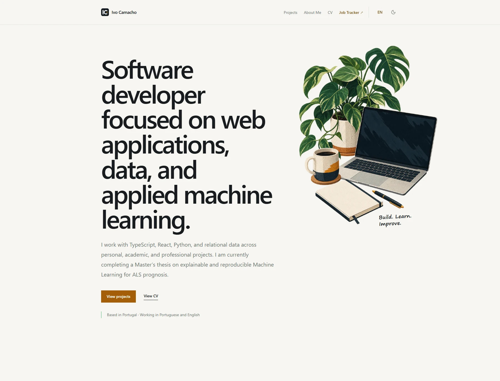
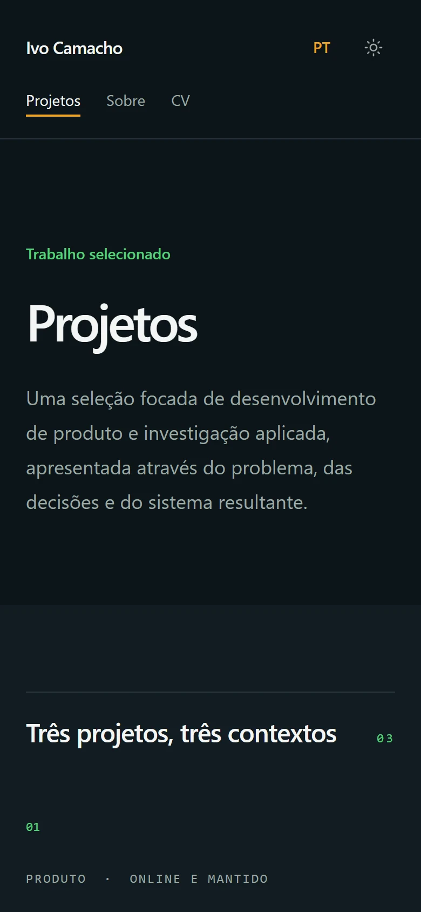

# Ivo Camacho — Professional Portfolio

[ivocamacho.com](https://ivocamacho.com) is a bilingual professional portfolio focused on software development, web applications, relational data, and applied Machine Learning. It presents projects as complete case studies, connecting the problem, technical decisions, evidence, and outcome instead of acting as a simple repository index.



## Highlights

- English and European Portuguese content on stable `/en` and `/pt` routes.
- Three detailed case studies: a live job application tracker, ALS prognosis research, and this portfolio.
- A responsive editorial interface with dedicated desktop, tablet, and mobile compositions.
- Light and dark themes based on semantic colour tokens.
- Accessible navigation, visible focus states, reduced-motion support, descriptive image alternatives, and a skip link.
- Route-specific metadata, social preview images, canonical URLs, `hreflang` alternatives, structured data, a sitemap, and robots rules.
- Static output with no application server or content-management dependency.

## Featured work

| Project | Context | Main technologies |
| --- | --- | --- |
| [Job Application Tracker](https://jobs.ivocamacho.com) | Full-stack product, live and maintained | Next.js, React, TypeScript, Supabase, PostgreSQL, RLS |
| [Explainable Machine Learning for ALS Prognosis](https://github.com/NotAnnieMore/ALSThesis) | Completed academic research | Python, Jupyter Notebook, Machine Learning, Explainable AI |
| Professional Portfolio | Bilingual editorial website | React, TypeScript, Vite, Tailwind CSS, React Router, i18next |

## Interface

The visual system uses strong typographic hierarchy, generous spacing, restrained green and orange accents, botanical illustrations, and real project evidence. Shared editorial section headers keep Home, Projects, About, and CV consistent without forcing every section into the same card layout.

On smaller screens, navigation, typography, spacing, image scale, and content order adapt independently. Decorative annotations are removed when they would compete with the content.



## Technology

- React 19 and TypeScript
- Vite 8
- Tailwind CSS 4
- React Router 8
- i18next and react-i18next
- Lucide React
- ESLint and TypeScript project builds

The content model is separated from the interface: language-neutral project, experience, education, skill, link, and media data live in typed modules, while editorial text lives in locale files. Both languages are rendered through the same React components.

## Local development

### Requirements

- Node.js `20.19+` or `22.12+`
- npm

```bash
git clone https://github.com/NotAnnieMore/portfolio.git
cd portfolio
npm install
npm run dev
```

Vite will print the local URL, normally `http://localhost:5173`.

## Available commands

| Command | Purpose |
| --- | --- |
| `npm run dev` | Start the Vite development server |
| `npm run lint` | Run the ESLint checks |
| `npm run build` | Type-check and create the production build |
| `npm run preview` | Preview the production build locally |

Before publishing a change, run:

```bash
npm run lint
npm run build
```

## Project structure

```text
src/
├── app/          Locale routing and application shell
├── components/   Shared UI, layout, home, and project components
├── data/         Typed projects, experience, education, skills, and links
├── i18n/         English and European Portuguese editorial content
├── pages/        Home, Projects, About, CV, and project routes
├── styles/       Global tokens, responsive rules, and motion
└── utils/        Route metadata and supporting behaviour

public/
├── cv/           Stable public CV PDFs
├── images/       Editorial illustrations and project evidence
├── og/           Route-specific 1200 × 630 social preview images
├── robots.txt
├── sitemap.xml
└── site.webmanifest
```

Product, design, content, accessibility, and workflow requirements are versioned in [`docs/context`](docs/context).

## Content updates

Project facts and media are defined in [`src/data/projects.ts`](src/data/projects.ts). Localized project copy and page text are maintained in:

- [`src/i18n/locales/en.ts`](src/i18n/locales/en.ts)
- [`src/i18n/locales/pt-PT.ts`](src/i18n/locales/pt-PT.ts)

Images should be exported in an efficient web format, include their intrinsic dimensions in the data model, and have accurate alternative text and captions in both languages.

## Metadata and discovery

Each route supplies a localized title and description through `usePageMeta`. The site also includes:

- Canonical URLs for the intended production domain.
- English, `pt-PT`, and `x-default` alternate links.
- Open Graph and Twitter large-image metadata.
- `Person` and `WebSite` JSON-LD structured data.
- A bilingual XML sitemap covering every public route and case study.
- A web app manifest, branded favicons, and route-specific social images.

When adding a public route, update its metadata translations, social image mapping, and `public/sitemap.xml` together.

## Updating the CVs

The website uses stable public paths:

- `/cv/ivo-camacho-cv-en.pdf`
- `/cv/ivo-camacho-cv-pt.pdf`

For a normal versioned update, replace the corresponding file in `public/cv/`, commit it, run the validation commands, and deploy the new build.

For an urgent PDF-only update, the file can be replaced directly in the deployed `/cv/` directory when its name remains unchanged. The same file should then be copied back into `public/cv/` and committed so the repository remains the source of truth.

## Deployment

`npm run build` creates the static production output in `dist/`. The contents can be uploaded to the document root configured for `ivocamacho.com`.

The `.htaccess` file in `public/` is copied to `dist/` and provides the fallback required for direct access to client-side routes such as `/en/projects` and `/pt/about` on Apache hosting.

## Links

- [LinkedIn](https://www.linkedin.com/in/ivocamacho99)
- [GitHub](https://github.com/NotAnnieMore)
